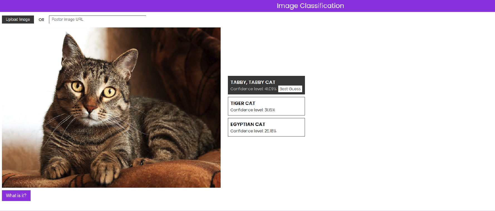

# Image Classification



---
## ⚙️ Technologies 
* [ReactJs](https://reactjs.org/)
* [Firebase](https://www.googleadservices.com/pagead/aclk?sa=L&ai=DChcSEwiMh6bpkJP2AhVBD5EKHY57AXYYABABGgJjZQ&ohost=www.google.com&cid=CAESWOD2aJQ9UAlMGkhr4SHDIoCl6xq_ujMKwoih3wA2pPyAEysU_U000FDo2Ud2MYBy3wCmIU_6ZrLL91qTyd2zqWE9MfbkzEnRcXyNx6N0NTlBPMifTCCRUT4&sig=AOD64_2gc59V47PYnkKP43DnmrkLua23BA&q&adurl&ved=2ahUKEwj-_Z7pkJP2AhUSIbkGHRbtAEcQ0Qx6BAgFEAE)
* [TensorflowJS](https://www.tensorflow.org/js)
* [Create React App](https://github.com/facebook/create-react-app)
## 🛸 How to run it
Clone this repository and access its directory
```bash
git clone https://github.com/rafaelmgr12/image-classification.git
cd image-classification
```

Now to start, use the following commands
```bash
  # install depedencies
  yarn
  # init project
  yarn start
```

The app will be available in your browser at http://localhost:3000.

Remembering that it will be necessary to create an account on [Firebase](https://firebase.google.com/) and a project to deploy on web.

## 🤖 Project

This Project was made for my interest in machine learning. The pre-trained model was chosen was [mobilenet](https://arxiv.org/abs/1704.04861), for classification/identification of objects. You can find more information on how to implement this model [here](https://github.com/tensorflow/tfjs-models/tree/master/mobilenet).

This project can be found at this [link](https://image-classify-4ed0f.web.app/).

##  👣 Next Steps
- [ ] Add Typescript
- [ ] Add Styled Components
- [ ] Add New models


##  📝 License
This project is under the MIT license. See the [LICENSE](LICENSE.md) file for more details.

---
Made by Rafael Ribeiro with ❤️
